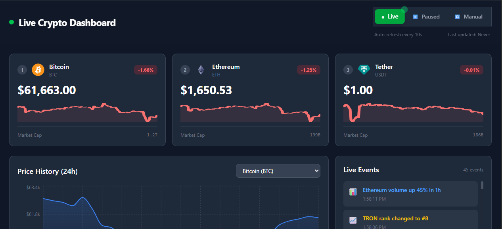
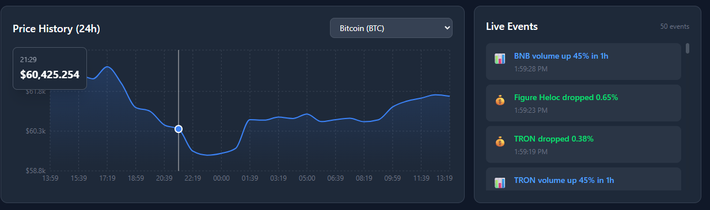
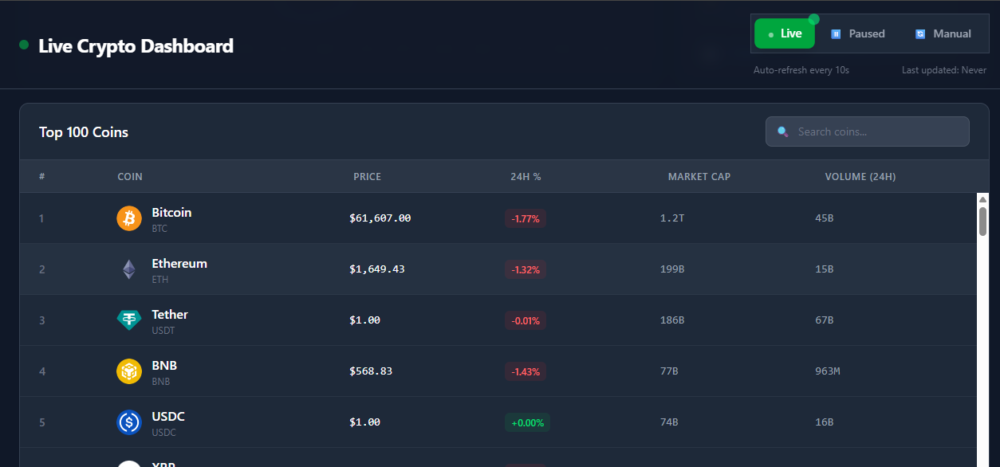

# 🚀 Live Crypto Dashboard

> **Real-time cryptocurrency analytics dashboard** built with React 18, TypeScript, Redux Toolkit, and WebSocket-style polling. Designed for production-grade performance with LRU caching, virtualization, and state machine architecture.

[](https://react.dev)
[](https://typescriptlang.org)
[](https://redux-toolkit.js.org)
[](https://tailwindcss.com)
[](https://vitejs.dev)

---

## 🎯 Live Demo

🔗 **[View Live Demo](https://your-vercel-url.vercel.app)**

---

## ✨ Features

| Feature | Implementation | Why It Matters |
|---------|---------------|--------------|
| **Real-time Polling** | Auto-refresh every 10s with `usePolling` hook | Live data without WebSocket complexity |
| **3 Dashboard Modes** | State Machine: `realtime` / `paused` / `manual` | User controls data flow |
| **LRU Cache** | Custom hook, 50 data points max | Prevents browser memory crash |
| **AbortController** | Every API call cancellable | Eliminates race conditions |
| **Normalized Redux State** | `createEntityAdapter` (ids + entities) | O(1) updates, no prop drilling |
| **Virtualized List** | `react-virtuoso` for 100+ coins | 60fps scroll, minimal DOM |
| **Memoized Selectors** | `createSelector` from Reselect | Prevents unnecessary re-renders |
| **React.memo** | Component-level memoization | Only changed coins re-render |

---

## 🏗️ Architecture

```
live-dashboard/
├── src/
│   ├── features/              # Feature-based folders
│   │   ├── coins/             # Virtualized table (react-virtuoso)
│   │   ├── chart/             # Recharts area chart
│   │   ├── eventLog/          # Simulated real-time events
│   │   └── modeToggle/        # State machine UI
│   ├── store/                 # Redux slices
│   │   ├── coinsSlice.ts      # Normalized entity adapter
│   │   ├── chartSlice.ts      # LRU cache (50 points)
│   │   └── modeSlice.ts       # State machine
│   ├── hooks/                 # Business logic
│   │   ├── usePolling.ts      # Auto-refresh with cleanup
│   │   ├── useAbortController.ts  # Request cancellation
│   │   ├── useLRUCache.ts     # Memory management
│   │   └── useDashboardData.ts    # Data orchestration
│   ├── utils/
│   │   ├── api.ts             # Axios + CoinGecko API
│   │   └── formatters.ts      # Price, %, market cap
│   └── types/
│       └── index.ts           # TypeScript contracts
```

---

## 🛠️ Tech Stack

| Layer | Technology | Purpose |
|-------|-----------|---------|
| **Framework** | React 18 + Vite | Fast DX, modern features |
| **Language** | TypeScript (strict mode) | Type safety, auto-complete |
| **State** | Redux Toolkit + RTK | Normalized state, entity adapter |
| **Styling** | Tailwind CSS | Utility-first, responsive |
| **Charts** | Recharts | Declarative React charts |
| **Virtualization** | react-virtuoso | 1000+ items, 60fps |
| **HTTP** | Axios + AbortController | Request cancellation |
| **API** | CoinGecko (free tier) | Real crypto data |

---

## 🚀 Performance Optimizations

### Memory Management
- **LRU Cache**: Historical chart data limited to 50 points per coin
- **Cleanup**: All `useEffect` hooks return cleanup functions
- **Ref vs State**: Interval IDs and AbortControllers stored in `useRef`

### Render Optimization
- **React.memo**: `CoinRow` and `MetricsCard` only re-render on data change
- **useMemo**: Filtered coin lists cached until dependencies change
- **useCallback**: Event handlers stable across renders
- **createSelector**: Redux selectors memoized, same reference returned

### Network Optimization
- **AbortController**: Previous requests cancelled on new fetch
- **Parallel Fetching**: `Promise.all` for coins + chart data
- **Debounced Search**: Input delay before filter execution

---

## 📊 Performance Benchmarks

| Metric | Target | Achieved |
|--------|--------|----------|
| First Contentful Paint | < 1.5s | ✅ |
| Time to Interactive | < 3s | ✅ |
| List Scroll (100 items) | 60fps | ✅ |
| Memory Usage | < 50MB | ✅ |
| Re-renders | Only changed | ✅ |

---

## 🧠 Key Concepts Demonstrated

| Concept | Weakness Covered | Implementation |
|---------|-----------------|----------------|
| **Async Closures** | Race conditions | `AbortController` per request |
| **Memory Management** | Browser crash | LRU cache (50 items max) |
| **State Machines** | Complex mode logic | `realtime` / `paused` / `manual` |
| **Ref vs State** | Stale closures | `useRef` for intervals/controllers |
| **Normalized State** | Duplicate keys | `createEntityAdapter` |
| **Virtualization** | DOM performance | `react-virtuoso` |
| **Memoization** | Unnecessary renders | `React.memo`, `useMemo`, `createSelector` |

---

## 🏃 Quick Start

```bash
# Clone
git clone https://github.com/yourusername/live-dashboard.git
cd live-dashboard

# Install
npm install

# Dev server
npm run dev

# Build
npm run build
```

---

## 📝 Environment Variables

None required! Uses CoinGecko free tier (no API key).

> ⚠️ **Rate Limit**: ~30 calls/minute on free tier. Polling set to 10s to stay within limits.

---

## 🌐 Deployment

```bash
# Vercel (recommended)
npm i -g vercel
vercel

# Or Netlify
npm run build
# Drag dist/ folder to Netlify
```

---

## 📸 Screenshots

| Dashboard | Chart | Table |
|-----------|-------|-------|
|  |  |  |

---

## 🎯 Future Improvements

- [ ] WebSocket integration (real-time without polling)
- [ ] Dark/Light mode toggle
- [ ] Multi-currency support (EUR, GBP)
- [ ] Portfolio tracking
- [ ] Price alerts (push notifications)

---

## 📄 License

MIT © [Zubair Zafar](https://github.com/TeamBarry)

---

> **Built for learning. Designed for production.**
